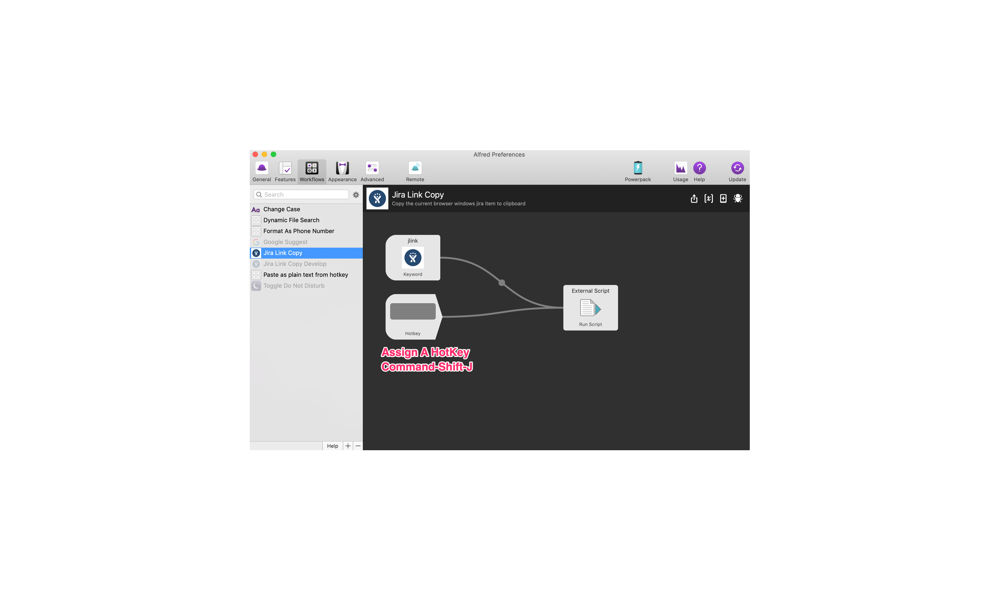
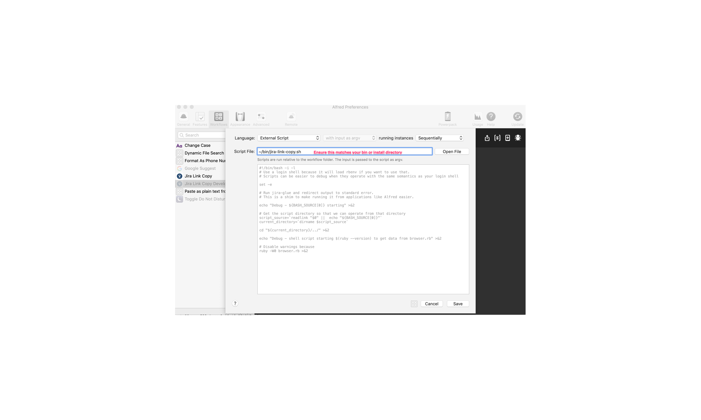

# Setup Alfred workflow
 * Clone the repo and do the setup from the main readme
 * Use the commands below from the main directory to setup Alfred
 * Link the shell script into your local bin directory.  This is where Alfred looks for the script by default
 ```sh
   ln -s $PWD/bin/jira-link-copy.sh ~/bin/
 ```
  * Install the Alfred Workflow
```sh
  open 'alfred/Jira Link Copy.alfredworkflow'
```
* If you used a different directory to hold the script you will need to update the workflow External Script Path






